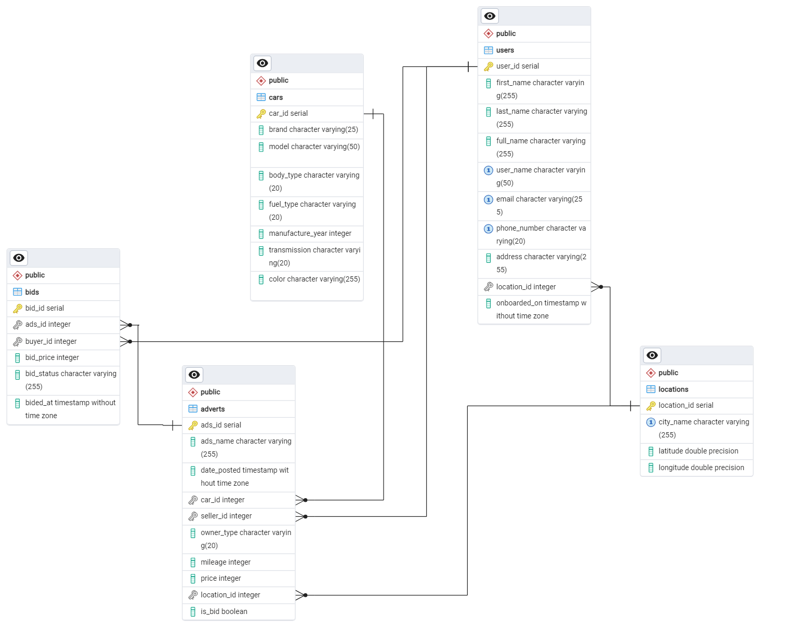

# Used Car Database Platform

A comprehensive database design implementation for a used car marketplace platform that facilitates direct connections between buyers and sellers. This project focuses on creating a robust database architecture that handles core marketplace functionalities and can be used for transactional and analytical queries.

for detail design process and analytics please check on [My Medium Post](https://medium.com/@taufiqrohmand/uncovering-databases-deep-dive-relational-database-design-for-used-cars-marketplace-platform-using-6791c7de653d)

## 🎯 Project Overview

This repository contains the complete database design and implementation for a used car marketplace platform with the following key features:
- Direct buyer-seller matchmaking
- Detailed vehicle listings management
- Analytics for business insights

### Project Structure:
```
Databse Design:.
│   .env
│   .gitignore
│   cars-schema.sql
│   cars_erd.png
│   cars_erd_pgad.pgerd
│   generate_dummy.ipynb
│   github-readme.md
│
├───output
└───queries
        Analytics.sql
        Transactional.sql
```

### Tech Stack:
* Programming Language: Python
* Framework/Library: Pandas, NumPy, SQLAlchemy, Faker
* Database: PostgreSQL
* Tools: Git, Jupyter Notebook


## 📊 Database Design

### Table Structure

| Table Name | Description | Key Fields |
|------------|-------------|------------|
| locations | store location information of available platform services (indonesian) | `location_id`, `city_name`, `latitude`, `longitude` |
| cars | store information about cars that can be sold | `car_id`, `brand`, `model`, `body_type`, `fuel_type`, `manufacture_year`, `transmission`, `color` |
| users | store user information for both sellers and buyers | `user_id`, `first_name`, `last_name`, `full_name`, `user_name`, `email`, `phone_number`, `address`, `location_id`, `onboarded_on` |
| adverts | save advertisements for cars for sale along with details of the condition of the car | `ads_id`, `ads_name`, `date_posted`, `car_id`, `seller_id`, `owner_type`, `mileage`, `price`, `location_id`, `is_bid` |
| bids | store bidding activities between sellers and buyers | `bid_id`, `ads_id`, `buyer_id`, `bid_price`, `bid_status`, `bid_at` |

###  Entity Relationship Diagram



## 📊 Sample Queries

### Transactional Query Examples

```sql
--- Search for the nearest used car based on a city ID
SELECT a.ads_id , a.ads_name , c.brand , c.model , c.manufacture_year, a.price,
euclidean_distance(u.location_id,a.location_id)
FROM users u 
LEFT JOIN adverts a ON u.user_id = a.seller_id 
LEFT JOIN cars c ON c.car_id = a.car_id 
WHERE u.location_id = 3173 AND a.ads_id  IS NOT NULL
ORDER BY 7
```

### Analytical Query Examples

```sql
-- Compare car prices based on average prices per city
WITH avgcitycar AS (
		SELECT l.city_name, c.model, c.fuel_type, c.manufacture_year , a.price,
		ROUND(AVG(a.price) OVER (PARTITION BY l.city_name, c.model, c.fuel_type, c.manufacture_year)) AS avg_price_city,
		row_number () OVER (PARTITION BY l.city_name ORDER BY random()) baris
		FROM adverts a 
		LEFT JOIN cars c 
		ON a.car_id  = c.car_id 
		LEFT JOIN locations l 
		ON a.location_id  = l.location_id
		ORDER BY l.location_id, 6
		)

SELECT acc.city_name, acc.model, acc.fuel_type, acc.manufacture_year, acc.price, acc.avg_price_city
FROM avgcitycar acc
WHERE acc.baris <=5;
```
